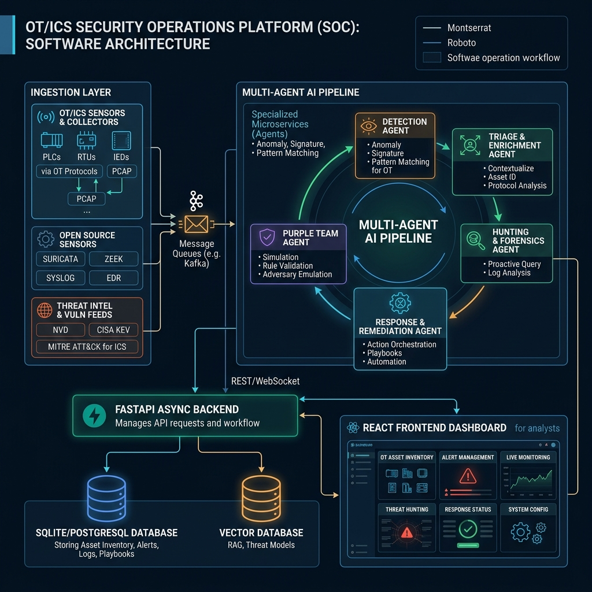
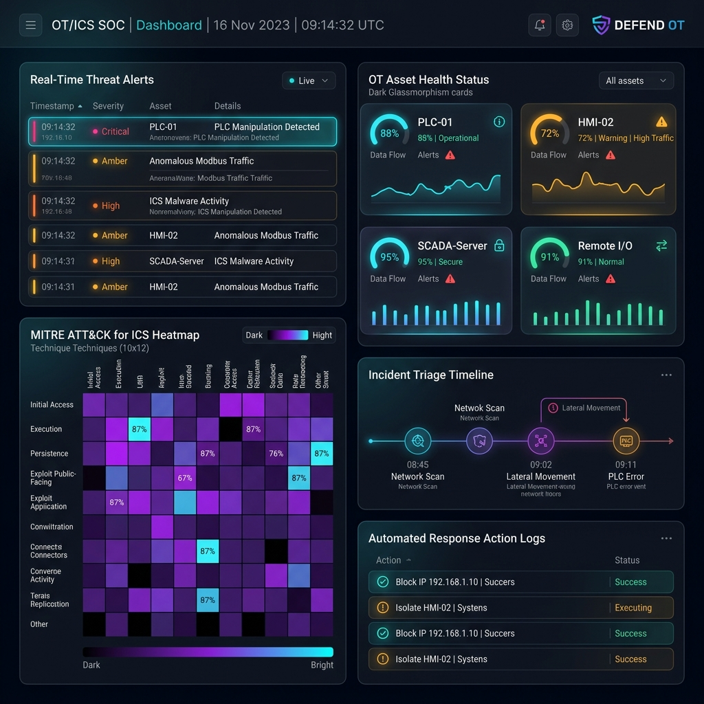

# OT/ICS-Aware Security Operations Platform (SOC)

**OPCODE IMPACT 2026 | Hackathon Submission**

**Team ID:** OPC005

## 1. Problem Statement
Industrial Control Systems (ICS) and Operational Technology (OT) environments operating alongside IT infrastructure face increasingly sophisticated cyber threats. Modern Security Operations Centers (SOCs) struggle with fragmented asset visibility, delayed vulnerability ingestion (NVD & CISA KEV), manual event triage overhead, and a lack of AI-assisted, safety-aware incident response autonomy tailored for critical OT safety zones.

## 2. Solution Title
OT/ICS-Aware Next-Gen Security Operations Platform (SOC)

## 3. Solution Description
Our solution is an OT/ICS-aware, AI-assisted security operations platform designed for unified asset inventory, automated vulnerability matching (NVD + CISA KEV), and real-time security-event ingestion (Suricata / Zeek / generic). It orchestrates a multi-agent AI pipeline (Detect → Triage → Hunt → Response → Purple Team) with deterministic rule-based fallbacks for offline reliability. Featuring MITRE ATT&CK mapping, OT topology & protocol discovery, SBOM management, and strict OT safety-zone autonomy policies, it empowers security analysts with end-to-end threat detection, triage, and safe remediation.

## 4. Architecture Diagram


**Workflow Overview:**
1. **Ingest & Match:** Sensors collect OT/IT events and assets; automated background schedulers sync NVD and CISA KEV feeds to match advisories against asset CPEs.
2. **Detect & Triage:** Multi-agent pipeline (Detect Agent & Triage Agent) clusters events/alerts by IP and asset, automatically opening cases mapped to MITRE ATT&CK tactics & techniques.
3. **Safety-Aware Response:** AI Response Agent drafts action plans evaluated against safety autonomy policies (requiring mandatory human approval for OT safety/field zones).
4. **Validation & Hunting:** Purple-Team validation tests telemetry against ATT&CK techniques, while Hunt Agent executes validated, column-whitelisted threat queries.

## 5. Technology Stack
- **Frontend:** React 18, TypeScript, Vite, Tailwind CSS v4, Lucide Icons
- **Backend:** Python 3.11+, FastAPI, Async SQLAlchemy 2.0, Alembic, Pydantic v2, Uvicorn
- **Database:** SQLite (development / testing) / PostgreSQL (production asyncpg)
- **Other Technologies:** Docker & Docker Compose, Anthropic Claude / OpenAI LLM APIs, NVD & CISA KEV API Feeds, Pytest, Fernet Encryption

## 6. Quick Start Guide
**Prerequisites:** Python 3.11+, Node.js 18+, Docker (optional)

**Installation & Execution:**
```bash
# 1. Clone the repository and setup Python virtual environment
python3 -m venv .venv
source .venv/bin/activate
pip install -r requirements.txt

# 2. Configure environment variables
cp .env.example .env

# 3. Launch Backend API Server
python3 -m uvicorn app.main:app --reload      # Available at http://localhost:8000/docs

# 4. In a separate terminal, launch Frontend development server
cd frontend
npm install
npm run dev                                  # Available at http://localhost:3000
```

*Demo Login (when `SEED_DEMO=true`):* `admin@example.com` / `password123`

## 7. Output Screenshots


The application provides an interactive dark-themed SOC dashboard featuring real-time alert streams, OT asset health status monitors, MITRE ATT&CK heatmap matrix visualizations, incident triage timelines, and automated response action execution feeds.

## 8. Future Scope
- Integration with live network TAP sensors and eBPF kernel telemetry drivers for real-time packet capturing.
- Hardware-in-the-Loop (HIL) PLC validation and automated Modbus/DNP3 field-device payload inspection.

## 9. Team Contributions
| Member Name | Contribution |
|-------------|--------------|
| MANIKANDAN P | Backend Architecture, FastAPI API Routers, AI/ML Multi-Agent Pipelines & Detection Engines |
| ABINAYA R | UI/UX Design & Frontend Development (React + Tailwind CSS v4 Components & Dashboard) |
| SOWMIYA S | Cybersecurity Research, Threat Modeling, MITRE ATT&CK Mapping & Compliance Engine |

## 10. Tools Used
| Tool / Platform | Purpose / Why Used |
|-----------------|--------------------|
| FastAPI & Async SQLAlchemy 2.0 | High-performance asynchronous backend API framework and database ORM |
| React 18 + Vite + Tailwind 4 | Modern, responsive dark-mode web dashboard UI |
| Anthropic Claude / OpenAI API | AI-driven threat detection, automated incident triage, and response playbooks |
| Docker & Docker Compose | Multi-container deployment for database and application backend |
| Git & GitHub | Distributed version control and collaborative development |
